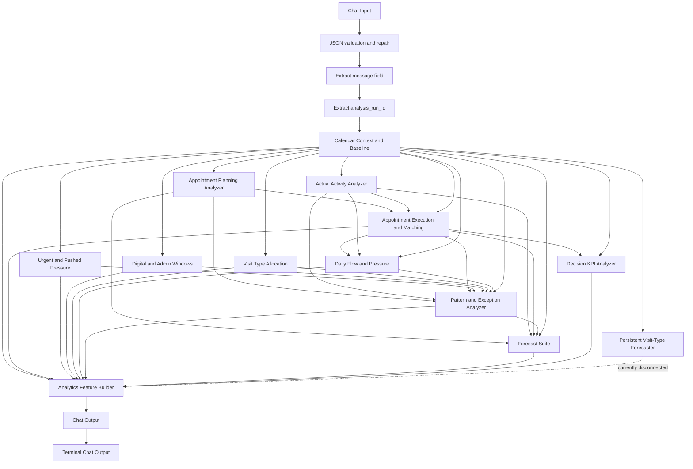

# Analytics - Lior

## Workflow identity

- Langflow name: `Analytics - Lior`
- Flow ID: `db3bfc7e-572b-4388-9642-1716f094a066`
- Project ID: `0bdc0e0b-8b90-4e77-96c3-85979fbcdd09`
- Snapshot analyzed: `2026-09-17T11:31:03Z`
- Graph size: 32 nodes, 44 edges
- Executable components: 19
- Notes: 13
- MCP enabled: no

## Purpose

This is a deterministic physician-calendar analytics pipeline. It accepts an existing
`analysis_run_id`, loads the associated schedule, appointments, visits, and reference
data, computes operational evidence and forecasts, assigns every finding to
`recommendation`, `insight`, or `ignore`, persists the result, and returns the completed
analytics contract.

There is no LLM in this workflow. Recommendation eligibility is decided here by code and
thresholds, not by the downstream recommendation agents.

## Existing calendar settings contract

The workflow now inventories all relevant existing preferences and reserves before the
appointment KPI scope filter is applied.

`decision_kpi_analyzer-IBs8T` emits `existing_calendar_settings` with:

- `contract_version: v1`
- `complete`
- inventory source and analysis period
- every recurring preference window
- configured preferred visit types
- actual booked visit-type mix
- preference utilization and compliance
- every recurring reserve window
- defined and booked reserve units
- reserve booking utilization
- reserve actualization measurement status

The ordinary appointment KPIs remain limited to `פנוי` and `העדפה`. Reserve definitions
are read from the raw calendar rows separately, so they no longer disappear before
reserve analysis.

The offline v2 patch keeps the primary historical matcher limited to ordinary
appointment KPIs and adds an isolated `reserve_to_visit_reconciliation` path. It
matches reserve rows only to otherwise-unused visits for the same member and date,
with a maximum 90-minute distance. Reserve matches never enter primary no-show,
delay, capacity, or `match_records` calculations. When reconciliation cannot run,
actualization is reported as `unavailable`; a measured zero remains distinct from
missing data.

The same patch resolves configured visit-type codes through the visit-type reference
table while preserving both `preferred_code` and the Hebrew `preferred_name`.

`analytics_feature_builder-f0hrQ` attaches `existing_settings_context` to every
Recommendation-tier candidate. It checks:

- the candidate's source window;
- the target window for capacity reallocation;
- every setting for a calendar-wide segment change;
- exact and partial overlap using half-open time intervals;
- both preferences and reserves.

Each context states whether inventory was complete, which windows were checked, every
overlapping setting, and whether resolution is required before implementation.

The final persisted `metrics` contract now includes the complete
`existing_calendar_settings` inventory.

The v2 patch is generated by `tools/build_lior_workflow_patches.py`. It is prepared and
tested offline; deployment and a database-backed rerun remain separate validation
steps.

## End-to-end flow



## External input

### Actual input shape

The connected graph expects the Chat Input text to be a JSON object with a `message`
field:

```json
{
  "message": "123"
}
```

The `message` value may also contain text with an explicit ID:

```json
{
  "message": "Run analytics for analysis_run_id 123"
}
```

Accepted by the ID extractor:

- A positive integer.
- A digit-only string.
- Text containing `analysis_run_id`, optionally followed by `:`, `=`, or `-`.
- Text containing `analysis run id`.
- Repeated references to the same ID.

Rejected:

- Zero or a negative ID.
- No identifiable ID.
- Multiple distinct IDs.

Although the ID extractor can parse a bare integer, a bare Chat Input such as `123`
does not satisfy the preceding `{message}` parser. At the external boundary, use the
object shown above.

### Input path

1. `ChatInput-4WIMD.message`
2. `JSONToData-drahn.json_as_string`
3. `ParserComponent-G5V3O.input_data`, configured with `{message}`
4. `analysis_run_id_extractor-zDZns.agent_input`
5. `calendar_context_baseline-5ujcR.input_value`

### Input repair behavior

`JSONToData-drahn` has automatic and aggressive repair enabled with six passes. It can
remove fences/comments, normalize literals and quotes, and add missing punctuation.
If repair fails, it emits an error object. There is no error branch, so the downstream
parser emits an empty value and the ID extractor fails.

## External output

The meaningful output is produced by
`analytics_feature_builder-f0hrQ.analytics_metrics`.

It is then converted twice:

1. Builder JSON/Data → `ChatOutput-qGGac`
2. Message → `ChatOutput-h2Dfl`

The terminal output is therefore a Langflow `Message` whose text represents the
analytics JSON contract, not raw JSON.

### Root output contract

```text
valid
analysis_run_id
analytics_complete
metrics
persistence
recommendation_candidate_counts
errors
```

### `metrics` contract

```text
analysis_run_id
analysis_context
performance_summary
recommendation_evidence
insight_candidates
ignored_evidence_summary
segment_fit_summary
existing_calendar_settings
required_analysis_domains
required_analysis_domains_contract
threshold_policy
data_quality
business_guardrails
```

`required_analysis_domains` is a deterministic, persisted four-domain audit:

- configured segment size versus documented actual visit duration, by visit type;
- no-show by weekday and 60-minute window;
- no-show comparison between face-to-face and telephone/video appointments;
- every configured reserve window and its booking utilization and visit actualization.

Every domain is present even when it produces no recommendation. A checked domain uses
`outcome=no_change_recommended` when no candidate passed the Recommendation threshold.
If the visits source exposes neither a supported actual-duration field nor an encounter
end field, the segment-duration domain is marked `unavailable`; the start-to-next-start
proxy is never presented as actual visit duration.

### Recommendation evidence families

```text
digital_admin_window_candidates
telephone_video_window_candidates
visit_type_allocation_candidates
capacity_reallocation_candidates
workload_pressure_candidates
unplanned_demand_candidates
no_show_pattern_candidates
delay_pressure_candidates
preference_review_candidates
urgent_reserve_candidates
reserve_utilization_candidates
operational_buffer_candidates
segment_adjustment_candidates
candidate_conflicts
forecast_summary
```

Every recommendation candidate receives a stable ID and metric path, the decision tier,
threshold version, planning granularity, presentation metadata, and
`llm_may_change_decision_tier=false`.

Every finalized recommendation candidate and insight also receives a deterministic
`factual_basis` v2 contract. It contains:

- the full `analysis_window`;
- the separate `observed_pattern_span`, including every sorted occurrence date,
  first/last occurrence dates, and active-date count;
- the relevant weekday and time window, including a target window when applicable;
- the observed support count, eligible-occurrence denominator, and rate when available;
- relevant encounter, appointment, day, week, no-show, delay, or pair counts;
- relevant visit-type or modality attributes;
- the threshold evaluation, whether recurring-language wording is allowed, and whether
  the occurrences are distributed sufficiently to allow “לאורך התקופה”.

The factual basis is attached before `metrics` is serialized and persisted. Late
forecast insights are clipped to the baseline schedule before this persistence point.
An isolated event is explicitly marked and cannot authorize wording such as recurring,
consistent, or significant. Distribution across the analysis window requires at least
three dates, at least 70% first-to-last coverage, first/last dates within the outer 15%
of the window, and activity in at least three analysis-window quarters.

## Components

### 1. Chat Input

- Node: `ChatInput-4WIMD`
- Output: `message`
- Role: accepts the caller payload and optionally stores it in chat history.
- Connected to: `JSONToData-drahn.json_as_string`.
- Attached files are supported by the generic component but are not used by this graph.

### 2. Jeen JSON / structured output validation

- Node: `JSONToData-drahn`
- Output: `output` as JSON/Data.
- Role: parses and repairs the input JSON.
- Configuration: auto-fix on, aggressive repair on, six passes.
- Connected to: `ParserComponent-G5V3O.input_data`.

### 3. Parser

- Node: `ParserComponent-G5V3O`
- Output: `parsed_text` as Message.
- Role: extracts the top-level `message` property with template `{message}`.
- Connected to: `analysis_run_id_extractor-zDZns.agent_input`.

### 4. Analysis Run ID Extractor

- Node: `analysis_run_id_extractor-zDZns`
- Outputs:
  - `analysis_run_id`: connected numeric Message.
  - `extraction_details`: disconnected diagnostic JSON.
- Role: normalizes a positive run ID and rejects ambiguous input.
- It does not create a run; the run must already exist.

### 5. Calendar Context & Baseline

- Node: `calendar_context_baseline-5ujcR`
- Output: `baseline`.
- Role: root data loader and canonical context builder.
- Reads the analysis run, doctor, calendar, schedule, appointment/visit boundaries,
  status distributions, recurrence rules, segment distributions, and explicit
  non-working markers.
- Establishes the canonical analysis period used by all downstream analyzers.
- Updates the run's `analysis_period_from` and `analysis_period_to`.

Important calculations:

- Regular segment: GCD of positive regular/base-source visit durations.
- Fallback segment: GCD of non-pushed rows, then all positive rows.
- Pushed segment: calculated separately.
- Schedule cycle: LCM of recurrence intervals.
- Weekly equivalent minutes: occurrence minutes divided by recurrence interval.
- Full-day absence: explicit non-working markers covering at least 80% of scheduled
  minutes.
- Edge tolerance: maximum of the regular segment and 30 minutes.

Baseline output includes:

```text
valid
analysis_run_id
analysis_run_status
doctor
calendar
appointment_scope
analysis_period
analysis_exclusions
segment
schedule
analytics_rules
warnings
errors
```

### 6. Appointment Planning & Booking Analyzer

- Node: `appointment_analytics-fIdbE`
- Output: `appointment_analytics`.
- Inputs: baseline plus database reads.
- Scope: statuses `פנוי` and `העדפה`.
- A row is booked when member identity exists.
- Calculates source/status/type distributions, temporal counts, 30/60-minute demand
  grids, lead time, lead buckets, and fill curves.
- Negative lead times are excluded.
- Fill checkpoints: 30, 14, 7, 3, 1, and 0 days before appointment.

### 7. Actual Activity & Workload Analyzer

- Node: `actual_visit_analytics-2VN0s`
- Output: `actual_visit_analytics`.
- Inputs: baseline plus documented encounter starts.
- Excludes rows outside the canonical period or explicit non-working intervals.
- Retains whether activity is inside or outside baseline schedule.
- Calculates temporal workload grids, first/last daily start spans, and consecutive
  different-patient start intervals.
- The interval is a flow/end proxy, not actual visit duration.
- Patient identities are hashed.

### 8. Appointment Execution & Matching Analyzer

- Node: `historical_performance_analyzer-cDHUJ`
- Output: `historical_performance`.
- Inputs: baseline, appointment analytics, and a visits edge.
- Re-queries appointments and visits; the connected `visits` value is not read by its
  implementation.
- Reconstructs logical appointments by member/date/signature and collapses contiguous
  segments.
- Learns expected local delay using weekday+hour, weekday, global, then zero fallback.
- Performs greedy one-to-one appointment/visit matching.
- Classifies no-shows as confirmed, probable, ambiguous, or source conflict.
- Emits only hashed patient identifiers.

Matching confidence:

- High: adjusted difference up to 30 minutes.
- Medium: up to 90 minutes.
- Low: above 90 minutes.
- Delay evidence is limited to raw delay from -30 through 180 minutes with high or
  medium confidence.

### 9. Urgent / Reserve & Pushed Pressure Analyzer

- Node: `urgent_reserve_pressure_analyzer-m0uiz`
- Output: `pushed_urgent_patterns`.
- Inputs: baseline plus appointment records.
- Separates pushed, urgent, and overlapping pushed+urgent events.
- Scores candidates as:

```text
coverage × concentration_lift × sqrt(segment_row_count)
```

- Initial candidate gate requires at least eight weeks, medium/high stability, at least
  eight rows, lift at least 1.25, share-point lift at least 5%, and baseline overlap.
- Keeps up to five urgent and three pushed candidates.
- Pushed evidence fully shared with urgent evidence becomes support-only.
- Preserves the sorted active dates on urgent and pushed patterns and candidates as
  `occurrence_dates`, first/last occurrence dates, and active-date count.

### 10. Daily Flow & Operational Pressure Analyzer

- Node: `delay_operational_pressure_analyzer-b7ZXi`
- Output: `delay_segment_fit`.
- Inputs: baseline, historical matching, actual visits.
- Delay scope: matched regular, non-pushed appointments inside baseline.
- Calculates within-day delay accumulation slope.
- Segment-fit evidence requires consecutive starts that both match regular,
  non-pushed baseline appointments.
- Overrun threshold: maximum of two minutes and 15% of the regular segment.

Daily pressure:

```text
max(0, median delay) × 2
+ unique pushed-or-urgent events × 3
+ overrun pairs × 2
```

The score is capped at 100.

### 11. Digital & Admin Window Analyzer

- Node: `digital_admin_window_analyzer-ATnIy`
- Output: `modality_time_patterns`.
- Inputs: baseline plus visits.
- Groups modality/payment labels by weekday and hour.
- Candidate gate: at least six weeks, medium/high stability, at least 12 encounters,
  lift at least 1.2, and share-point lift at least 5%.
- Administrative-window recommendations require business validation before creating
  non-bookable time.

### 12. Visit Type Allocation Analyzer

- Node: `visit_type_allocation_analyzer-Xk1uM`
- Output: `visit_type_patterns`.
- Inputs: baseline, appointments, and visit-type reference data.
- Groups booked appointments by resolved visit type, weekday, and hour.
- Candidate gate: baseline overlap, at least four weeks, at least six booked rows,
  medium/high stability, at least 10% share, and a resolved business label.
- Strong preference: high stability and at least 30% share.
- Maximum output: 40 candidates.

Known inconsistency: the query selects calendar status, but this component does not
enforce the workflow-wide `פנוי`/`העדפה` filter inside its loop.

### 13. Demand, Pattern Stability & Exception Analyzer

- Node: `pattern_trend_analyzer-QDcFT`
- Output: `patterns_trends`.
- Inputs: baseline and all specialized branches.
- Joins planned rows, actual starts, matched outcomes, delays, and segment fit by
  weekday/hour.
- Aggregates recurring digital, urgent, pushed, and visit-type patterns.
- Top-window concentration uses the top 20% of windows.
- Weekday balance uses population coefficient of variation.
- Daily outliers use the 1.5 × IQR rule.
- Planned segment rows versus actual encounters are descriptive, not equivalent units.

### 14. Decision KPI & Recommendation Evidence Analyzer

- Node: `decision_kpi_analyzer-IBs8T`
- Output: `decision_kpis`.
- Inputs: baseline and historical matching.
- Uses the latest 26 weeks.
- Produces authoritative decision evidence for capacity, visit types, workload,
  unplanned activity, modality, no-show, delay, preference, reserve, urgent reserve,
  after-hours activity, weekly patient visits, and booking lead time.
- Probes the visits table for a whitelisted documented duration or encounter-end field,
  matches those visits to planned appointment visit types, and summarizes actual
  duration by visit type. Unsupported or absent source fields produce an explicit
  unavailable result. The source probe uses method-local safe aliases so Langflow's
  component extraction cannot omit the whitelist; supported aliases include
  `actual_end_time`, `actual_end_datetime`, and documented duration-minute fields.
- Compares no-show rates by scheduled appointment modality. The denominator is the
  regular, non-pushed planned appointment population; unknown visit-type modality is
  retained separately rather than guessed. The business mapping explicitly classifies
  `ביקור רגיל` as face-to-face. A comparison is unavailable unless both modality
  groups are non-empty and at least 80% of appointments are classified. The same 80%
  floor applies independently to eligible no-show signals. The contract records total
  no-show signals, pushed signals excluded from this comparison, eligible signals, and
  classified/unknown eligible signals so differences from the all-scope no-show audit
  are explained rather than hidden.
- Serializes the date sets used by date-backed evidence as `occurrence_dates`,
  `first_occurrence_date`, `last_occurrence_date`, and `active_date_count`.

Selected rules:

- Reliable segment inventory requires 0.8–1.2 coverage of theoretical inventory.
- True utilization is booked source segment units divided by scheduled segment units.
- Initial high utilization: at least 0.85.
- Initial low utilization: at most 0.35.
- Urgent reserve quantity is `ceil(P75)` including zero occurrences, capped by
  hour capacity.
- Weekly patient visits exclude digital/admin activity.
- Missing weeks are not imputed as zero.

### 15. Forecast Suite

- Node: `forecast_capacity_planner-FVOy0`
- Output: `forecast_capacity`.
- Configured horizon: 20 weeks.
- Inputs: baseline, appointments, visits, historical matching, and patterns.
- The connected `appointments` value is not used directly.
- Trains on at most the latest 12 complete eligible weeks.
- Preserves missing calendar-week gaps on the regression axis.
- Excludes materially absence-affected weeks.
- Uses a linear trend and floors forecasts at zero.
- Confidence is heuristic and capped at medium.
- Forecasts are supplemental evidence and cannot create capacity or extra-hours
  recommendations by themselves.

### 16. Persistent Visit-Type Load Forecaster

- Node: `persistent_visit_type_load_forecaster-sBQMo`
- Output: `visit_type_load_forecast`.
- Inputs: baseline.
- Builds prior-week occupancy, dominant visit type, realization, and booking-history
  features.
- Trains L2 logistic regression with Newton/IRLS.
- Uses model probabilities only when walk-forward Brier score beats persistence and
  top-1 accuracy is not worse; otherwise it uses historical persistence.
- Chooses at most one visit type per weekday/window.

Configured gates include:

- 20-week recommendation horizon.
- 60-minute windows.
- Occupancy at least 80%.
- Dominant share at least 40%.
- Realization at least 50%.
- Recommendation probability at least 60%.
- Margin over second type at least 10%.
- At least four history weeks per pair.
- At least ten training weeks.

Critical: this output has no outgoing edge, so it does not affect the final result.

### 17. Analytics Feature Builder – Deterministic Actionable Contract

- Node: `analytics_feature_builder-f0hrQ`
- Output: `analytics_metrics`.
- Role: final deterministic classifier, contract builder, and persistence component.
- Threshold policy: `v1.5`.
- Decision window: 26 weeks.
- Historical context: up to 52 weeks.
- Persists metrics by default.
- Generates stable SHA-1-based candidate and insight IDs.
- Clips recommendation windows to the baseline schedule.
- Persists all four required analysis domains before recommendation filtering can omit
  below-threshold evidence.
- Attaches the `factual_basis` v2 analysis-window and observed-pattern-span contract
  before persistence.
- Copies pushed-pattern occurrence dates into operational-buffer evidence, never
  borrows dates from an unrelated same-time Decision row, and marks a date list
  incomplete when it cannot account for the reported support count.
- Detects conflicts only for exact or positive-minute schedule commitments.
- Explicitly forbids an LLM from changing a decision tier.

Some connected inputs are not read directly by the code:

- `appointments`
- `visits`
- `patterns`
- `modality_time_patterns`
- `visit_type_patterns`

Those edges still create execution dependencies.

### 18. First Chat Output

- Node: `ChatOutput-qGGac`
- Input: analytics builder JSON/Data.
- Output: `message`.
- Converts the contract to a Message and stores it.
- Connected to the second Chat Output.

### 19. Terminal Chat Output

- Node: `ChatOutput-h2Dfl`
- Input: first Chat Output Message.
- Output: terminal Message.
- Converts/stores the message a second time.

## Classification principles

- Recommendation status is deterministic.
- Forecast, delay, workload, and after-hours evidence cannot independently create a
  schedule recommendation.
- Segment increases are never recommended.
- Segment decreases require strong, repeated evidence and must apply globally.
- Capacity reallocation requires both a high-utilization source and a low-utilization
  target.
- Digital/admin, modality, visit-type, urgent reserve, no-show, preference, and
  operational-buffer recommendations each have explicit recurrence, support, count,
  lift, or utilization gates.
- Universal support is:

```text
max(absolute floor, ceil(rate threshold × eligible occurrences))
```

For exact threshold values, inspect `analytics_feature_builder-f0hrQ` before changing
classification behavior.

## Persistence and side effects

- Chat Input may store the caller message.
- Calendar Baseline updates the run's canonical analysis period.
- Analytics Feature Builder:
  - inserts the compact `metrics` object into the analysis metrics store;
  - marks the run `COMPLETED`;
  - sets completion time if absent.
- Both Chat Output nodes may store output messages.
- Persistence errors are returned in the output instead of being raised:
  - `valid=false`;
  - `analytics_complete` may still be `true`;
  - `errors` contains the persistence failure.

## Contract with Recommendation - Lior

The Recommendation workflow does not consume this Chat Output directly. Its caller sends
the same `analysis_run_id`, and Recommendation loads the newest persisted metrics record.

Responsibility boundary:

- Analytics owns evidence calculation, threshold application, decision tier,
  candidate IDs, metric paths, data-quality warnings, and persistence.
- Recommendation owns domain wording, candidate coverage, evidence re-verification,
  calendar-rule canonicalization, conflict presentation, and Hebrew rendering.

The recommendation agents must never promote an insight or ignored item to a
recommendation.

## Known risks and editing cautions

1. Database configuration is empty in the serialized DB-backed nodes. Runtime injection
   must exist or the workflow cannot execute.
2. The persistent visit-type forecaster is computed but disconnected.
3. The two Chat Outputs can duplicate conversion and message storage.
4. The historical analyzer's connected visits value is unused.
5. The forecast's connected appointments value is unused.
6. Several final-builder inputs create dependencies but are not read directly.
7. Visit-type analysis does not consistently enforce the shared calendar-status scope.
8. Urgent/pushed analysis does not select or filter calendar status.
9. Recurrence greater than one week can be inexact without an anchor.
10. The terminal result is Message text rather than raw JSON.
11. Errors from input repair are not routed explicitly.
12. `analysis_run_id` is consumed, not created, by this workflow.
13. A database-backed rerun through the public API currently fails because the
    serialized database URL is empty. Runtime database injection is required to verify
    which documented actual-duration alias exists and whether it contains usable data.

## Before editing

- Preserve `analysis_run_id` across every contract.
- Preserve stable candidate IDs and metric paths.
- Do not let LLM logic enter this workflow's decision-tier stage.
- Keep Recommendation and Insight thresholds separate.
- Verify calendar-status and non-working-day scope across every analyzer.
- Check persistence behavior whenever the final contract changes.
- If connecting the persistent forecaster, define its exact downstream contract and
  whether it is evidence, insight-only, or recommendation-eligible.
- If removing one Chat Output, test API response shape and message-history behavior.
