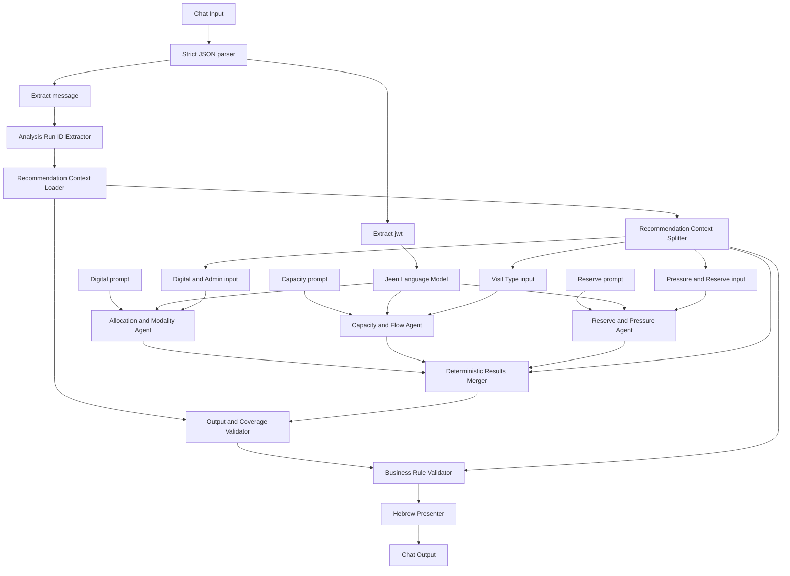

# Recommendation - Lior

## Workflow identity

- Langflow name: `Recommendation - Lior`
- Flow ID: `e8e69eb0-6607-4bec-8117-386cb861900e`
- Project ID: `0bdc0e0b-8b90-4e77-96c3-85979fbcdd09`
- Snapshot analyzed: `2026-09-17T11:31:05Z`
- Graph size: 29 nodes, 26 edges
- Executable components: 19
- Notes: 10
- MCP enabled: no

## Purpose

This workflow turns a completed `Analytics - Lior` run into a client-facing Hebrew
calendar recommendation report.

It does not recalculate the analytics. It receives an `analysis_run_id`, loads the
persisted deterministic Analytics contract, sends three domain-specific subsets to
three agents for recommendation wording, and then applies deterministic coverage,
evidence, business-rule, and presentation stages.

The final objective is to improve completed patient visits per week without adding or
removing physician working days or total working hours.

## Responsibility boundary

- Analytics decides whether evidence is a recommendation, insight, or ignored.
- The three LLM agents phrase already-approved recommendation candidates.
- Deterministic components restore omitted candidates and reject unsupported content.
- The business validator rebuilds concrete calendar actions from verified Analytics
  evidence.
- The presenter renders the final Hebrew report.

An agent is not allowed to promote an Analytics insight into a recommendation.

## Existing preference and reserve enforcement

The workflow now consumes Analytics' complete `existing_calendar_settings` inventory.
This is scheduling context, not decision-tier evidence.

`recommendation_context_splitter-dU9xQ` passes the inventory into the shared business
context and all three agent domains. Older Analytics records without this contract are
marked incomplete.

`recommendation_business_rule_validator-TvYcq` is the authoritative enforcement point.
It ignores any overlap claims made by an agent and recalculates them from the canonical,
baseline-clipped recommendation windows.

For every recommendation it:

- checks the source window;
- checks the target window for capacity reallocation;
- checks all settings for a calendar-wide segment change;
- detects exact and partial preference/reserve overlaps;
- attaches `existing_settings_context`;
- records an explicit strategy for every overlap;
- blocks the recommendation if the settings inventory is unavailable or incomplete.

An urgent-reserve recommendation that overlaps an existing reserve receives:

```text
reserve_handling = adjust_existing_reserve_not_add
```

It is therefore presented as an adjustment of the existing reserve, not creation of a
second reserve.

`recommendation_presenter-TuUXM` adds deterministic Hebrew explanations. Relevant
preference explanations include the configured visit type, actual booked visit-type
mix, and utilization or compliance when available. Reserve explanations include
booking utilization and actualization when available. When actualization is unavailable,
the report explicitly says it was not interpreted as zero.

The offline v2 patch also:

- renders the resolved Hebrew preference name and classifies overlap as preserve,
  change, or conflict;
- turns a 100%-compliant matching preference into a keep-current action;
- states whether every urgent-reserve action overlaps an existing reserve and displays
  defined, booked, matched, and urgent-matched quantities when available;
- gives a quantified urgent reserve priority over a pushed buffer in the same planning
  window so minutes are not allocated twice;
- suppresses semantic duplicate insights and forecasts without direction and magnitude;
- rounds client summary averages and renders supported operational impact only.

The v2 patch is generated by `tools/build_lior_workflow_patches.py`. It is prepared and
tested offline; deployment and an authenticated end-to-end rerun remain separate
validation steps.

All three connected agent prompts also instruct the model to account for the same
settings, but acceptance does not depend on agent compliance: the business validator
and presenter enforce it after the agent stage.

## End-to-end flow



## External input

### Required input shape

The connected graph expects a JSON-encoded object in Chat Input:

```json
{
  "jwt": "<caller JWT>",
  "message": "123"
}
```

- `jwt` authenticates the Jeen language model.
- `message` identifies the completed Analytics run.

The `message` field accepts:

- A positive integer.
- A digit-only string.
- Text explicitly containing `analysis_run_id`.
- Text explicitly containing `analysis run id`.

It rejects zero, negative IDs, missing IDs, and multiple distinct IDs.

### Input path

The parsed input fans into two branches.

Authentication branch:

1. `ChatInput-w0DA9.message`
2. `JSONToData-0uhCI.json_as_string`
3. `ParserComponent-vzfxO`, configured with `{jwt}`
4. `JeenLanguageModel-9eFOW.access_token`

Analysis branch:

1. `ChatInput-w0DA9.message`
2. `JSONToData-0uhCI.json_as_string`
3. `ParserComponent-kFGuy`, configured with `{message}`
4. `analysis_run_id_extractor-DwrL3`
5. `recommendation_context_loader-u7P2v`

### Strict parsing

`JSONToData-0uhCI` has automatic repair and aggressive repair disabled. Despite its
display name, malformed JSON is not repaired. Missing fields become empty strings in
the generic parser, causing a later authentication or run-ID failure.

## External output

Only the presenter's friendly Hebrew Message is connected to the terminal Chat Output:

`recommendation_presenter-TuUXM.user_friendly_recommendations`
→ `ChatOutput-uC6ME.input_value`.

The presenter's structured `validated_recommendations_json` output is disconnected.

The report layout is:

```text
## המלצות ליומן הרופא
introductory explanation
### תמונת מצב
### המלצות לפי ימי השבוע
### המלצות כלליות            (optional)
### תובנות כלליות            (optional)
### תחומי הניתוח הנדרשים
## הלו״ז השבועי עם ההמלצות
```

The required-analysis section is deterministic and always contains:

- segment size versus documented actual visit duration by visit type;
- no-show by weekday and hour;
- face-to-face versus telephone/video no-show;
- configured reserve windows and their utilization and actualization.

Each checked domain explicitly says whether a recommendation was found. When none was
found, it renders `התחום נבדק ולא נמצאה המלצה לשינוי`. A domain whose required source
data is unavailable remains visible and says that the check could not be completed;
missing data is never described as evidence that no change is needed.

The modality domain also renders classified, total, and unknown appointment counts and
the required 80% coverage floor. It separately explains how many all-scope no-show
signals were excluded as pushed appointments and how many eligible signals were
classified. An empty face-to-face or telephone/video group, or appointment/numerator
coverage below the floor, is described as an incomplete comparison. Required-analysis
paragraphs and bullet groups are separated by blank Markdown lines so the client
renderer does not concatenate labels, bullets, and outcomes.

When no qualified general insight survives deterministic filtering, the report keeps
the `תובנות כלליות` section and explicitly says that no additional general insight was
found.

Weekday-specific insights remain available in the structured Analytics and
Recommendation contracts but are intentionally omitted from the client-facing report.
General insights continue to be rendered when their factual claim is quantified.
Forecast-change insights without both direction and magnitude are suppressed.

The weekly schedule is rendered as a three-column Markdown table (`יום`, `שעות`,
`המלצה`). Each recommendation receives its own row. Working-time intervals not covered
by a recommendation are shown as `פעילות רגילה`, so the table represents the complete
weekly schedule rather than only changed windows.

Every displayed recommendation and insight includes a deterministic Hebrew
`בסיס הנתונים` explanation sourced from Analytics' verified `factual_basis` contract.
The analysis window is shown once in the situation summary. Each basis explanation
starts at the observed pattern span, followed by the relevant weekday/time, support
frequency, and applicable counts or attributes.
For up to five occurrences it lists every exact date. For more than five it renders
only the first/last dates plus the verified numerator and denominator. The situation
summary also identifies the analysis period.

Wording equivalent to recurring, consistent, or significant is allowed only when the
verified factual basis explicitly authorizes recurrence wording. Otherwise the
presenter uses neutral observed-event wording and displays the actual numerator and
denominator. Missing legacy factual-basis data never authorizes recurring wording.
The phrase “לאורך התקופה” is independently gated by
`throughout_period_wording_allowed`; partial-window patterns never receive that phrase.
The presenter also verifies that the occurrence-date list can account for the reported
support count. If the dates are incomplete or inconsistent, it suppresses both the
date span and “לאורך התקופה” while retaining the verified frequency.
Adjacent recommendations are kept separate when their evidence refers to different
source windows or occurrence spans, so a displayed time range always matches its
factual basis.

All Latin letters and underscores are removed from the rendered report.

## Execution stages

### Stage 1: Parse caller input

The Chat Input is parsed as strict JSON. One parser extracts the JWT and another
extracts the message containing `analysis_run_id`.

### Stage 2: Load persisted Analytics context

The run ID is normalized and passed to the context loader. The loader queries the
latest persisted Analytics metrics for that run and validates the expected contract.

### Stage 3: Split by recommendation domain

The context splitter:

- separates already-actionable candidates from insights and supporting evidence;
- creates three compact agent inputs;
- produces shared business context for deterministic post-processing;
- excludes candidates marked non-actionable or support-only.

### Stage 4: Run three agents in parallel

The same Jeen model instance is supplied to three independently prompted agents:

- Allocation and modality.
- Capacity, flow, and segment.
- Reserve and pressure.

### Stage 5: Deterministic merge and coverage

The merger parses agent JSON, deduplicates recommendations, restores omitted candidates
with deterministic fallback wording, resolves competing allocations, and synchronizes
the three branches.

### Stage 6: Verify evidence

The output validator resolves every cited metric path against the original Analytics
metrics. Unsupported actions and unverifiable recommendations are rejected.

### Stage 7: Enforce business rules

The business validator ignores unreliable LLM calendar details and reconstructs
canonical actions from verified candidates and baseline schedule constraints.
It also copies the verified factual basis onto each canonical recommendation and
reports factual-basis coverage in its validation object.

### Stage 8: Render Hebrew output

The presenter groups compatible items, filters conflicting insights, creates the weekly
schedule view, and removes technical/Latin wording.

## Major data contracts

### Context loader output

```text
valid
analysis_run_id
source
metrics
warnings
errors
```

Expected persisted `metrics`:

```text
analysis_run_id
analysis_context
performance_summary
recommendation_evidence
insight_candidates
business_guardrails
threshold_policy
data_quality
```

### Splitter business context

```text
valid
analysis_run_id
planning_task
analysis_context
performance_summary
baseline_constraints
business_guardrails
evidence_pack
analytics_insights
threshold_policy
data_quality
context_warnings
```

Each domain agent receives:

```text
analysis_run_id
domain
planning_task
baseline_constraints
performance_summary
business_guardrails
actionable_candidates
relevant_conflicts
candidate_count
```

Each candidate wrapper contains:

```text
metric_path
candidate_id
value
```

### Expected agent response

The prompts ask each agent to return:

```text
analysis_run_id
recommendation_summary
recommendations
insufficient_evidence
warnings
```

Expected recommendation fields:

```text
priority
recommendation_type
schedule_change
working_hours_change_minutes
calendar_action
title
recommendation_text
reason
expected_impact
requires_business_validation
evidence
```

Expected `calendar_action`:

```text
weekday
time_from
time_to
action
target
recommended_minutes
recommended_slots
```

The graph consumes the agents' free-text `response`, not `structured_response`.
Therefore this schema is prompt-enforced rather than technically guaranteed.

### Merger output

```text
analysis_run_id
recommendation_summary
recommendations
candidate_dispositions
analytics_insights
suppressed_analytics_insights
suppressed_recommendations
performance_summary
insufficient_evidence
warnings
deterministic_coverage
```

### Evidence validator additions

```text
valid
rejected_recommendations
candidate_insights
validation
```

Verified evidence includes:

```text
metric_root
verified
actual_metric_value
```

### Business validator output

```text
valid
analysis_run_id
recommendations
candidate_dispositions
candidate_insights
analytics_insights
performance_summary
rejected_recommendations
insufficient_evidence
warnings
baseline_constraints
candidate_conflicts
data_quality
threshold_policy
validation
```

## Components

### 1. Chat Input

- Node: `ChatInput-w0DA9`
- Output: `message`.
- Role: receives and optionally stores the caller's JSON-encoded Message.
- Connected to: `JSONToData-0uhCI.json_as_string`.

### 2. Jeen JSON / structured output validation

- Node: `JSONToData-0uhCI`
- Output: `output`.
- Role: strict JSON parsing.
- Repair switches are off; six configured repair passes are therefore inactive.
- Output fans to both Parser nodes.

### 3. JWT Parser

- Node: `ParserComponent-vzfxO`
- Pattern: `{jwt}`.
- Output: `parsed_text`.
- Role: extracts model authentication from the top-level input.
- Connected to: `JeenLanguageModel-9eFOW.access_token`.

### 4. Message Parser

- Node: `ParserComponent-kFGuy`
- Pattern: `{message}`.
- Output: `parsed_text`.
- Role: extracts the run-ID-bearing caller message.
- Connected to: `analysis_run_id_extractor-DwrL3.agent_input`.

### 5. Analysis Run ID Extractor

- Node: `analysis_run_id_extractor-DwrL3`
- Outputs:
  - `analysis_run_id`: connected numeric Message.
  - `extraction_details`: disconnected diagnostic JSON.
- Role: accepts one positive ID and rejects ambiguous IDs.

### 6. Recommendation Context Loader

- Node: `recommendation_context_loader-u7P2v`
- Outputs:
  - `context`: connected Data.
  - `agent_input`: disconnected serialized Message.
- Role: loads and validates the newest persisted Analytics metrics record.
- Also reads the run status.
- A non-`COMPLETED` status produces a warning rather than automatic rejection.
- Can theoretically accept a complete Analytics contract directly, but the connected ID
  extractor always reduces its input to digits, so this graph always uses database
  lookup.

### 7. Recommendation Context Splitter

- Node: `recommendation_context_splitter-dU9xQ`
- Outputs:
  - `business_context`
  - `digital_admin_input`
  - `visit_type_input`
  - `pressure_reserve_input`
- Role: validates Analytics sections, filters actionable candidates, separates three
  agent domains, retains relevant schedule conflicts, and provides shared business
  context to the merger and validator.
- Carries the persisted `required_analysis_domains` audit as non-actionable context so
  it cannot be changed or omitted by an agent.
- Excludes:
  - `eligible_for_calendar_recommendation=false`
  - `supporting_evidence_only=true`

### 8. Jeen Language Model

- Node: `JeenLanguageModel-9eFOW`
- Connected output: `model_output`.
- Disconnected output: `text_output`.
- Role: authenticated LangChain-compatible model shared by all three agents.
- Configuration: `gpt-5.4`, streaming enabled, temperature 0.7, top-p 1, timeout
  1200 seconds.
- Validates token presence, JWT shape, and expiry.

### 9. Allocation & Modality Prompt

- Node: `TextInput-enwvR`
- Output: `text`.
- Connected to: `Agent-nw0eZ.system_prompt`.
- Role: defines digital/admin, telephone/video, visit-type allocation, and preference
  behavior.
- Uses static text; global-variable mode is off.

### 10. Allocation & Modality Agent

- Node: `Agent-nw0eZ`
- Inputs: shared model, allocation prompt, `digital_admin_input`.
- Output used: `response`.
- Output unused: `structured_response`.
- Maximum six iterations; calculator enabled; current-date tool disabled; no external
  tools or memory.

Action families:

- Digital/admin window.
- Telephone/video window.
- Visit-type allocation.
- Preference review.

Special rule: overlapping telephone visit-type and telephone/video candidates represent
one practical recommendation and should cite both evidence paths.

### 11. Capacity & Flow Prompt

- Node: `TextInput-CsN8n`
- Output: `text`.
- Connected to: `Agent-1q7hm.system_prompt`.
- Role: defines capacity reallocation, workload, unplanned demand, no-show, delay, and
  segment behavior.

Important prompt rules:

- Delay is support-only, not a standalone recommendation.
- No-show evidence is not reserve evidence.
- Start-to-next-start cadence is not actual visit duration.
- Quantities must be copied exactly.
- Non-exact evidence must not become minute-by-minute schedule instructions.

### 12. Capacity & Flow Agent

- Node: `Agent-1q7hm`
- Inputs: shared model, capacity prompt, `visit_type_input`.
- Output used: `response`.
- Output unused: `structured_response`.
- Maximum six iterations; calculator enabled; no external tools or memory.

Despite the output field name `visit_type_input`, this splitter branch represents the
capacity/flow/segment domain.

### 13. Reserve & Pressure Prompt

- Node: `TextInput-t85tX`
- Output: `text`.
- Connected to: `Agent-N1co0.system_prompt`.
- Role: defines urgent reserve, reserve utilization, and operational-buffer wording.

Important distinctions:

- Pushed is not the same as urgent.
- Operational buffer must not be described as urgent reserve.
- Exact reserve quantities are copied.
- Unspecified buffer quantity remains a clinic decision.

### 14. Reserve & Pressure Agent

- Node: `Agent-N1co0`
- Inputs: shared model, reserve prompt, `pressure_reserve_input`.
- Output used: `response`.
- Output unused: `structured_response`.
- Maximum six iterations; calculator enabled; no external tools or memory.

### 15. Recommendation Results Merger – Deterministic Presentation Rules

- Node: `recommendation_results_merger-Cv4HR`
- Output: `merged_response` as Message containing JSON.
- Inputs: all three agent responses and splitter business context.
- Role: branch synchronization, parsing, deduplication, coverage recovery, conflict
  handling, ranking, and deterministic fallback generation.

Behavior:

- Parses plain, fenced, or embedded JSON.
- Treats invalid agent responses as empty objects.
- Restores every omitted actionable candidate with deterministic Hebrew wording.
- Deduplicates by action and evidence paths.
- Chooses one allocation recommendation for each exact weekday/time window.
- Preserves suppressed candidate dispositions.
- Merges adjacent windows only when recommendation signatures match exactly.
- Forces `working_hours_change_minutes=0`.

### 16. Recommendation Output & Candidate Coverage Validator

- Node: `recommendation_output_validator-smg31`
- Output: `validated_recommendations`.
- Inputs: merged agent result and original loaded context.
- Configuration: verified evidence required.
- Role: verifies every metric path and recommendation action against Analytics.

It:

- validates `analysis_run_id`;
- strips known path prefixes and resolves paths against source metrics;
- accepts only configured Recommendation-tier roots;
- corrects recommendation type from action;
- rejects unsupported actions or unverifiable evidence;
- restores genuinely missing candidates;
- preserves intentionally display-suppressed candidates.

### 17. Recommendation Business Rule Validator – Concrete Actions v15

- Node: `recommendation_business_rule_validator-TvYcq`
- Output: `business_validated_recommendations`.
- Inputs: evidence-validated recommendations and splitter business context.
- Role: creates canonical calendar actions from verified Analytics candidates.

It:

- ignores unreliable LLM calendar fields;
- clips source and target windows to baseline working windows;
- blocks weekday candidates with no baseline overlap;
- groups evidence only when action signatures and windows are compatible;
- enforces segment, capacity, reserve, and schedule invariants;
- copies verified factual basis onto canonical recommendations and counts gaps;
- propagates the complete required-domain audit to the presenter independently of
  recommendation candidate coverage;
- reports corrections and missing candidate coverage.

The node can still return `valid=true` while warnings or incomplete candidate coverage
exist. Consumers must inspect its `validation` object.

### 18. Recommendation Presenter – Friendly Hebrew

- Node: `recommendation_presenter-TuUXM`
- Outputs:
  - `user_friendly_recommendations`: connected Message.
  - `validated_recommendations_json`: disconnected JSON.
- Role: final non-technical Hebrew rendering.

It:

- discards vague or unknown actions;
- groups only compatible adjacent recommendations;
- keeps distinct actions separate even if their windows touch;
- suppresses allocation insights that overlap a visible allocation recommendation;
- formats performance, recommendations, insights, and the baseline weekly schedule;
- renders all four required analysis domains even when recommendation and insight lists
  are empty;
- renders the analysis window and observed occurrence dates/span, and neutralizes
  unsupported recurrence or full-period language;
- renders each recommendation as a separate Markdown subheading, omits an active-day
  count when it duplicates the support numerator, and removes punctuation left by
  filtered non-Hebrew attributes;
- removes threshold jargon, Latin letters, and underscores.

### 19. Chat Output

- Node: `ChatOutput-uC6ME`
- Input: presenter's friendly Message.
- Sender name: `Recommendation Validator`.
- Clean-data conversion enabled.
- Message storage disabled.
- Role: terminal client-facing result.

## Deterministic business invariants

- Analytics owns recommendation eligibility.
- Every actionable candidate must receive a disposition.
- Working days must not change.
- Total working time must not change.
- `working_hours_change_minutes` is forced to zero.
- Analytical hour windows are clipped to actual baseline windows.
- Competing allocations for the same exact window are resolved to one visible choice.
- Adjacent windows merge only for identical action semantics.
- Delay and workload alone do not produce standalone recommendations.
- No-show is not urgent/reserve evidence.
- Pushed demand is not urgent demand.
- Capacity reallocation requires explicit source and target windows.
- Segment increases are blocked.
- Segment decrease must:
  - use integer minutes;
  - be lower than the current segment;
  - be at least five minutes;
  - apply to all working days;
  - be marked as a schedule change.
- Other items are schedule changes only when Analytics supplies an exact allocation
  window.
- Forecast evidence is supplemental only.

## Fallback behavior

1. Malformed agent JSON becomes an empty agent result.
2. The merger creates deterministic Hebrew recommendations for omitted candidates.
3. The evidence validator rejects unsupported or unverifiable recommendations and
   restores unresolved candidates.
4. The business validator may block vague, off-schedule, invalid-segment, or incomplete
   reallocation actions.
5. The presenter may omit actions for which it has no concrete rendering rule.

This makes candidate coverage less dependent on agent quality, but a hard model or
authentication failure can still stop the graph before the merger.

## Persistence and external side effects

- Chat Input may store the incoming request when a session ID exists.
- Context Loader performs database reads:
  - analysis run status;
  - newest persisted metrics for the run.
- The three agents invoke the configured external completion service.
- Chat Output does not store the final response.
- No component writes calendar changes.
- No component updates Analytics records.
- The result is advisory.

## Known risks and editing cautions

1. Database configuration is empty in the serialized Context Loader. Without runtime
   injection, the workflow fails when loading by ID.
2. Direct-contract mode in the Context Loader is unreachable through current wiring.
3. Agent `structured_response` outputs exist but are unused; free-text responses are
   parsed instead.
4. Each Agent retains an internal prompt while a Text Input is connected to
   `system_prompt`; these copies can drift.
5. `require_action_specific_evidence` exists on the business validator but is not read
   by its implementation.
6. Allocation-suppression coverage semantics change between the output and business
   validators.
7. `valid=true` does not guarantee complete candidate coverage.
8. An empty validated insight list can be repopulated from business context due to
   fallback logic.
9. Some prompt mappings describe actions later rejected by deterministic validators.
10. Strict parsing behavior conflicts with the parser component's repair-oriented name.
11. Removing all Latin characters can damage legitimate acronyms or mixed-language
    visit labels.
12. The final structured JSON is unavailable externally because that presenter output
    is disconnected.

## Before editing

- Do not change candidate decision tiers in prompts or agents.
- Preserve `analysis_run_id`, `candidate_id`, and `metric_path`.
- Treat the three agents as wording layers, not analytics engines.
- Update both connected Text Inputs and any saved Agent prompt copies together.
- Test malformed agent output after changing prompts or model configuration.
- Inspect `validation.candidate_coverage_complete`, not only `valid`.
- Preserve total hours and working-day invariants.
- Verify the Hebrew presenter after adding an action type.
- If exposing structured output, connect it deliberately and define whether the API
  should return Message, JSON/Data, or both.
- If bypassing database lookup, rewire the Context Loader so it receives the full
  Analytics contract instead of the ID extractor's numeric Message.
